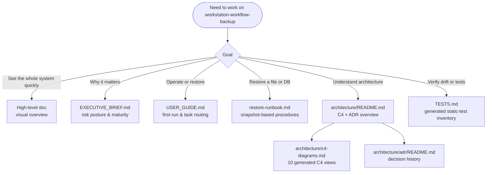

# WORKSTATION1 Workflow Backup Docs Index

> **Repo:** `workstation-workflow-backup`
> **Role:** high-frequency WORKSTATION1 → TrueNAS workflow-state backup
> **Runtime:** WSL systemd user timer, restricted NAS SSH identity, Windows SMB/robocopy helper
> **Sensitivity:** backup payloads and NAS state are private; this repo stores code/docs only
> **HTML policy:** Markdown is canonical; generated HTML companions are rendered with `scripts/render_docs.py` and drift-checked.

---

## Reading Path



---

## Documentation Ownership Matrix

| File | Purpose | Update when |
|---|---|---|
| [`../README.md`](../README.md) | Primary repo landing page: mission, operating concept, configuration, snapshot schedule, restore quick reference. | Backup scope, timer/snapshot schedule, install/operate flow, or restore reference changes. |
| [`../AGENTS.md`](../AGENTS.md) | Agent guardrails and safety constraints for the backup repo. | Safety boundaries, forbidden live operations, or required verification commands change. |
| [`../workstation-workflow-backup-high-level-doc.html`](../workstation-workflow-backup-high-level-doc.html) | Generated visual front door from `scripts/showcase.spec.json`: what it does, how it works, command groups, audience routing. | High-level capabilities, metrics, audience links, or safety-boundary wording changes. |
| [`EXECUTIVE_BRIEF.md`](EXECUTIVE_BRIEF.md) | Two-minute, code-free summary of value, risk posture, retention, and maturity. | Risk framing, retention posture, maturity claims, or executive-facing summary changes. |
| [`USER_GUIDE.md`](USER_GUIDE.md) | Task-first operating guide: first run, “I want to…” routing, failure alert response, and one safety rule. | Operator workflow, first-run steps, failure response, or task routing changes. |
| [`restore-runbook.md`](restore-runbook.md) | Ground-level restore procedures for repo files, Hermes DBs, Windows artifacts, and staged restore verification. | Restore commands, snapshot paths, integrity checks, or admin/runtime identity rules change. |
| [`architecture/README.md`](architecture/README.md) | Architecture atlas entry point: scope, views, model source, validation, and ADR map. | C4 model, architecture scope, validation command, or ADR inventory changes. |
| [`architecture/c4-diagrams.md`](architecture/c4-diagrams.md) | Generated C4/Structurizr diagram atlas for system context, containers, components, deployment, and runtime flows. | `docs/architecture/workspace.dsl` changes or diagram renders are regenerated. |
| [`architecture/adr/README.md`](architecture/adr/README.md) | Decision-record index for snapshot retention, timer/alerting, SQLite snapshots, growth guard, SMB, and NAS runtime hardening. | A decision is added, superseded, or materially revised. |
| [`TESTS.md`](TESTS.md) | Generated static-test inventory and coverage map. | Tests are added/removed/renamed or static coverage expectations change. |
| [`notes/`](notes/) | Time-specific implementation notes and incident/context receipts. | A durable operational note needs preservation but does not belong in the main runbook. |

---

## Validation

Docs-only change gate:

```bash
python3 scripts/generate_test_inventory.py --check
python3 scripts/generate_showcase.py --spec scripts/showcase.spec.json --check
python3 scripts/render_docs.py --repo . --slug workstation-workflow-backup --check
./scripts/run-tests.sh
git diff --check
git diff --cached --check
```

For live backup health, use `./scripts/verify-backup.sh`; do not run live NAS/provisioning commands for a docs-only review.

---

## Update Triggers

Update this index when:

- a durable Markdown or generated HTML doc is added, moved, or retired;
- backup cadence, snapshot retention, restore paths, or safety boundaries change;
- the C4/Structurizr model or ADR inventory changes;
- validation commands or generated-doc pipeline commands change;
- future agents would otherwise have to rediscover the documentation layout.
