# WORKSTATION1 Workflow Backup Architecture C4 Diagrams

> Single-file generated C4 diagram atlas. Canonical model: [`workspace.dsl`](workspace.dsl).

<!-- Generated from Structurizr exports; refresh from docs/architecture/workspace.dsl. -->

## Reading notes

- This file intentionally includes every generated C4 view in one Markdown document.
- Diagrams prefer clean rendered artifacts first, usually Graphviz SVG with white-backed relationship labels.
- Mermaid source is retained under each diagram for text review and diffability.
- Generated per-view wrappers remain available at [`diagrams/markdown/`](diagrams/markdown); generated artifact index: [`diagrams/README.md`](diagrams/README.md).

## Diagram index

| View | Section | Preferred render | Per-view page |
|---|---|---|---|
| `BackupRuntimeContainers` | [`BackupRuntimeContainers`](#backup-runtime-containers) | [`Graphviz SVG`](diagrams/dot-rendered/structurizr-BackupRuntimeContainers.svg) | [`BackupRuntimeContainers.md`](diagrams/markdown/BackupRuntimeContainers.md) |
| `FailureAlertFlow` | [`FailureAlertFlow`](#failure-alert-flow) | [`Graphviz SVG`](diagrams/dot-rendered/structurizr-FailureAlertFlow.svg) | [`FailureAlertFlow.md`](diagrams/markdown/FailureAlertFlow.md) |
| `HourlyMirrorPublishFlow` | [`HourlyMirrorPublishFlow`](#hourly-mirror-publish-flow) | [`Graphviz SVG`](diagrams/dot-rendered/structurizr-HourlyMirrorPublishFlow.svg) | [`HourlyMirrorPublishFlow.md`](diagrams/markdown/HourlyMirrorPublishFlow.md) |
| `HourlyPreflightSnapshotFlow` | [`HourlyPreflightSnapshotFlow`](#hourly-preflight-snapshot-flow) | [`Graphviz SVG`](diagrams/dot-rendered/structurizr-HourlyPreflightSnapshotFlow.svg) | [`HourlyPreflightSnapshotFlow.md`](diagrams/markdown/HourlyPreflightSnapshotFlow.md) |
| `LocalDeployment` | [`LocalDeployment`](#local-deployment) | [`Graphviz SVG`](diagrams/dot-rendered/structurizr-LocalDeployment.svg) | [`LocalDeployment.md`](diagrams/markdown/LocalDeployment.md) |
| `OpsProvisioningContainers` | [`OpsProvisioningContainers`](#ops-provisioning-containers) | [`Graphviz SVG`](diagrams/dot-rendered/structurizr-OpsProvisioningContainers.svg) | [`OpsProvisioningContainers.md`](diagrams/markdown/OpsProvisioningContainers.md) |
| `OrchestratorControlComponents` | [`OrchestratorControlComponents`](#orchestrator-control-components) | [`Graphviz SVG`](diagrams/dot-rendered/structurizr-OrchestratorControlComponents.svg) | [`OrchestratorControlComponents.md`](diagrams/markdown/OrchestratorControlComponents.md) |
| `OrchestratorSyncComponents` | [`OrchestratorSyncComponents`](#orchestrator-sync-components) | [`Graphviz SVG`](diagrams/dot-rendered/structurizr-OrchestratorSyncComponents.svg) | [`OrchestratorSyncComponents.md`](diagrams/markdown/OrchestratorSyncComponents.md) |
| `SystemContext` | [`SystemContext`](#system-context) | [`Graphviz SVG`](diagrams/dot-rendered/structurizr-SystemContext.svg) | [`SystemContext.md`](diagrams/markdown/SystemContext.md) |
| `TargetedRestoreFlow` | [`TargetedRestoreFlow`](#targeted-restore-flow) | [`Graphviz SVG`](diagrams/dot-rendered/structurizr-TargetedRestoreFlow.svg) | [`TargetedRestoreFlow.md`](diagrams/markdown/TargetedRestoreFlow.md) |

---

## Backup Runtime Containers

> C4 view `BackupRuntimeContainers`.

### Diagram

_Preferred Markdown display: Graphviz SVG. Mermaid source is retained below for text review._

Mermaid source

```mermaid
graph LR
  linkStyle default fill:#ffffff

  subgraph diagram ["Container View: WORKSTATION1 Workflow Backup"]
    style diagram fill:#ffffff,stroke:#ffffff

    22[("<div style='font-weight: bold'>WSL Workflow Sources</div><div style='font-size: 70%; margin-top: 0px'>[Software System]</div><div style='font-size: 80%; margin-top:10px'>Workflow-critical WSL paths:<br />~/repos, ~/.hermes, ~/.ssh,<br />systemd user config,<br />lifelog/browser-memory data,<br />and optional brain-code tree.</div>")]
    style 22 fill:#fef3c7,stroke:#d97706,color:#111827
    23[("<div style='font-weight: bold'>Windows Workflow Sources</div><div style='font-size: 70%; margin-top: 0px'>[Software System]</div><div style='font-size: 80%; margin-top:10px'>Selected Windows user-profile<br />artifacts: Desktop,<br />Documents, Downloads, Windows<br />.ssh/.wslconfig, Terminal/VS<br />Code/PowerShell config,<br />Chrome profile metadata, and<br />Startup entries.</div>")]
    style 23 fill:#fef3c7,stroke:#d97706,color:#111827
    24[("<div style='font-weight: bold'>TrueNAS Backup Dataset</div><div style='font-size: 70%; margin-top: 0px'>[Software System]</div><div style='font-size: 80%; margin-top:10px'>Encrypted TrueNAS dataset<br />v1/ws1/wf with current mirror<br />tree, manifests, SMB share<br />ws1-wf, and ZFS snapshot<br />history.</div>")]
    style 24 fill:#fef3c7,stroke:#d97706,color:#111827
    25["<div style='font-weight: bold'>TrueNAS Middleware and ZFS Control Plane</div><div style='font-size: 70%; margin-top: 0px'>[Software System]</div><div style='font-size: 80%; margin-top:10px'>root@10.99.98.221 management<br />surface used for ZFS<br />properties, snapshot tasks,<br />SMB share configuration, and<br />verification.</div>"]
    style 25 fill:#f3e8ff,stroke:#9333ea,color:#111827
    26[("<div style='font-weight: bold'>Hermes Bot Environment File</div><div style='font-size: 70%; margin-top: 0px'>[Software System]</div><div style='font-size: 80%; margin-top:10px'>Local ~/.hermes/.env values<br />that supply Telegram bot<br />token/chat settings to the<br />failure notifier; contents<br />are not stored in this repo.</div>")]
    style 26 fill:#fef3c7,stroke:#d97706,color:#111827
    27["<div style='font-weight: bold'>Telegram Bot API</div><div style='font-size: 70%; margin-top: 0px'>[Software System]</div><div style='font-size: 80%; margin-top:10px'>External API used only for<br />backup failure notifications.</div>"]
    style 27 fill:#f3e8ff,stroke:#9333ea,color:#111827

    subgraph 2 ["WORKSTATION1 Workflow Backup"]
      style 2 fill:#ffffff,stroke:#16a34a,color:#16a34a

      15["<div style='font-weight: bold'>SQLite Snapshotter</div><div style='font-size: 70%; margin-top: 0px'>[Container: Python 3, sqlite3]</div><div style='font-size: 80%; margin-top:10px'>Creates<br />application-consistent copies<br />of Hermes, lifelog,<br />browser-memory, and related<br />SQLite databases using<br />sqlite3 backup API; can<br />quick_check copies.</div>"]
      style 15 fill:#ecfeff,stroke:#0891b2,color:#111827
      16["<div style='font-weight: bold'>Windows Critical Sync Helper</div><div style='font-size: 70%; margin-top: 0px'>[Container: PowerShell + robocopy.exe]</div><div style='font-size: 80%; margin-top:10px'>PowerShell script launched<br />from WSL that uses<br />robocopy.exe to mirror<br />selected Windows profile<br />directories/files to the SMB<br />share and writes a Windows<br />sync manifest.</div>"]
      style 16 fill:#ecfeff,stroke:#0891b2,color:#111827
      17["<div style='font-weight: bold'>NAS Growth Guard</div><div style='font-size: 70%; margin-top: 0px'>[Container: Bash + remote Python + zfs CLI]</div><div style='font-size: 80%; margin-top:10px'>Read-only ZFS budget check<br />that enforces dataset-used,<br />snapshot-held, free-space,<br />and snapshot-count limits<br />before/after writes.</div>"]
      style 17 fill:#ecfeff,stroke:#0891b2,color:#111827
      20["<div style='font-weight: bold'>Failure Notifier</div><div style='font-size: 70%; margin-top: 0px'>[Container: Bash + Python urllib]</div><div style='font-size: 80%; margin-top:10px'>Best-effort Telegram failure<br />alert unit that reads last<br />status/log tail and Hermes<br />bot environment variables;<br />success runs stay silent.</div>"]
      style 20 fill:#ecfeff,stroke:#0891b2,color:#111827
      21[("<div style='font-weight: bold'>Run Ledger and Local State</div><div style='font-size: 70%; margin-top: 0px'>[Container: SQLite + JSON + logs on WSL filesystem]</div><div style='font-size: 80%; margin-top:10px'>Local status, logs, SQLite<br />run ledger, exported<br />run-history JSON, SQLite<br />snapshot cache, and Windows<br />manifest cache under<br />~/.local/state/workstation-workflow-backup.</div>")]
      style 21 fill:#fef3c7,stroke:#d97706,color:#111827
      3("<div style='font-weight: bold'>systemd User Timer and Service</div><div style='font-size: 70%; margin-top: 0px'>[Container: systemd --user units]</div><div style='font-size: 80%; margin-top:10px'>Hourly user-level scheduler<br />and oneshot service that run<br />the backup at minute 45 and<br />route failures to the<br />notifier.</div>")
      style 3 fill:#e0e7ff,stroke:#4f46e5,color:#111827
      4["<div style='font-weight: bold'>Backup Orchestrator</div><div style='font-size: 70%; margin-top: 0px'>[Container: Bash]</div><div style='font-size: 80%; margin-top:10px'>scripts/workflow-backup.sh<br />coordinates one backup run:<br />locking, logging, pre/post<br />guard checks, WSL rsync,<br />SQLite snapshots, Windows<br />sync, run-ledger updates, and<br />NAS manifest publication.</div>"]
      style 4 fill:#e0f2fe,stroke:#0284c7,color:#111827
    end

    3-. "<div>Starts hourly at :45 and<br />tracks service exit</div><div style='font-size: 70%'>[systemd --user]</div>" .->4
    3-. "<div>Triggers on nonzero service<br />result</div><div style='font-size: 70%'>[OnFailure]</div>" .->20
    4-. "<div>Writes logs, last-run.json,<br />run events, and exported<br />history in</div><div style='font-size: 70%'>[filesystem + sqlite3]</div>" .->21
    4-. "<div>Runs pre/post budget checks<br />through</div><div style='font-size: 70%'>[subprocess]</div>" .->17
    17-. "<div>Reads ZFS used, available,<br />usedbysnapshots, and snapshot<br />count from</div><div style='font-size: 70%'>[SSH + zfs]</div>" .->25
    4-. "<div>Creates consistent SQLite<br />backup copies with</div><div style='font-size: 70%'>[subprocess]</div>" .->15
    15-. "<div>Reads live SQLite databases<br />from</div><div style='font-size: 70%'>[sqlite3 backup API]</div>" .->22
    15-. "<div>Writes local SQLite snapshot<br />cache and manifest under</div><div style='font-size: 70%'>[filesystem]</div>" .->21
    4-. "<div>Mirrors configured WSL source<br />trees from</div><div style='font-size: 70%'>[sudo rsync]</div>" .->22
    4-. "<div>Writes current/wsl,<br />wsl-sqlite-snapshots, and<br />_manifests to</div><div style='font-size: 70%'>[SSH rsync + SSH cat]</div>" .->24
    4-. "<div>Launches Windows sync through</div><div style='font-size: 70%'>[PowerShell via WSL interop]</div>" .->16
    16-. "<div>Mirrors selected Windows<br />artifacts from</div><div style='font-size: 70%'>[robocopy.exe]</div>" .->23
    16-. "<div>Writes current/windows and<br />Windows manifests to</div><div style='font-size: 70%'>[SMB \\10.99.98.221\\ws1-wf]</div>" .->24
    16-. "<div>Leaves manifest cache for<br />ledger summaries</div><div style='font-size: 70%'></div>" .->21
    4-. "<div>Creates remote manifest<br />directories and relies on NAS<br />SSH access</div><div style='font-size: 70%'>[SSH]</div>" .->25
    4-. "<div>Exits nonzero so systemd can<br />alert through</div><div style='font-size: 70%'></div>" .->20
    20-. "<div>Reads last status and log<br />tail from</div><div style='font-size: 70%'>[filesystem]</div>" .->21
    20-. "<div>Reads Telegram bot token/chat<br />values from</div><div style='font-size: 70%'>[filesystem]</div>" .->26
    20-. "<div>Sends failure-only<br />notification to</div><div style='font-size: 70%'>[HTTPS]</div>" .->27

  end
```

### Derived artifacts

| Artifact | Link |
|---|---|
| Mermaid source | [`structurizr-BackupRuntimeContainers.mmd`](diagrams/structurizr-BackupRuntimeContainers.mmd) |
| Mermaid SVG | [`structurizr-BackupRuntimeContainers.svg`](diagrams/structurizr-BackupRuntimeContainers.svg) |
| Mermaid PNG | [`structurizr-BackupRuntimeContainers.png`](diagrams/structurizr-BackupRuntimeContainers.png) |
| DOT source | [`structurizr-BackupRuntimeContainers.dot`](diagrams/dot/structurizr-BackupRuntimeContainers.dot) |
| Graphviz SVG | [`structurizr-BackupRuntimeContainers.svg`](diagrams/dot-rendered/structurizr-BackupRuntimeContainers.svg) |
| Graphviz PNG | [`structurizr-BackupRuntimeContainers.png`](diagrams/dot-rendered/structurizr-BackupRuntimeContainers.png) |

---

## Failure Alert Flow

> C4 view `FailureAlertFlow`.

### Diagram

_Preferred Markdown display: Graphviz SVG. Mermaid source is retained below for text review._

Mermaid source

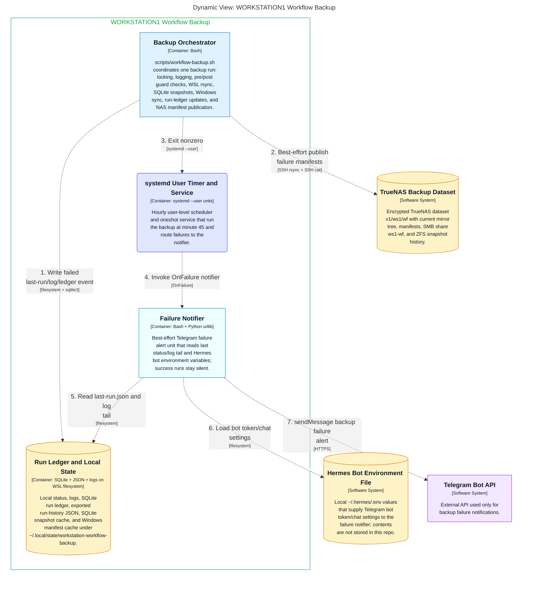

### Derived artifacts

| Artifact | Link |
|---|---|
| Mermaid source | [`structurizr-FailureAlertFlow.mmd`](diagrams/structurizr-FailureAlertFlow.mmd) |
| Mermaid SVG | [`structurizr-FailureAlertFlow.svg`](diagrams/structurizr-FailureAlertFlow.svg) |
| Mermaid PNG | [`structurizr-FailureAlertFlow.png`](diagrams/structurizr-FailureAlertFlow.png) |
| DOT source | [`structurizr-FailureAlertFlow.dot`](diagrams/dot/structurizr-FailureAlertFlow.dot) |
| Graphviz SVG | [`structurizr-FailureAlertFlow.svg`](diagrams/dot-rendered/structurizr-FailureAlertFlow.svg) |
| Graphviz PNG | [`structurizr-FailureAlertFlow.png`](diagrams/dot-rendered/structurizr-FailureAlertFlow.png) |

---

## Hourly Mirror Publish Flow

> C4 view `HourlyMirrorPublishFlow`.

### Diagram

_Preferred Markdown display: Graphviz SVG. Mermaid source is retained below for text review._

Mermaid source

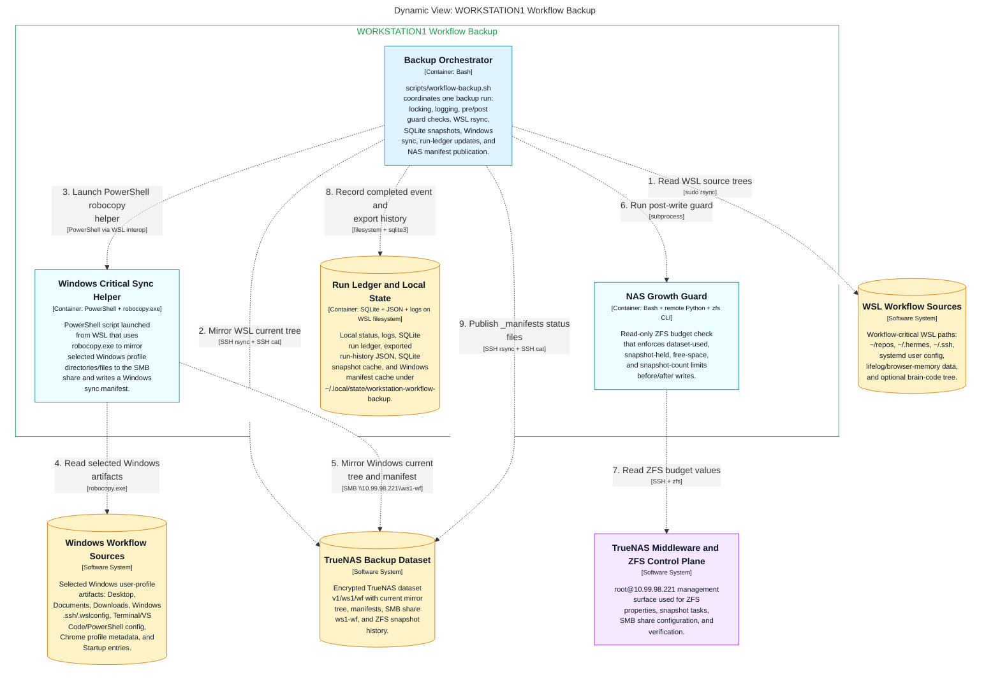

### Derived artifacts

| Artifact | Link |
|---|---|
| Mermaid source | [`structurizr-HourlyMirrorPublishFlow.mmd`](diagrams/structurizr-HourlyMirrorPublishFlow.mmd) |
| Mermaid SVG | [`structurizr-HourlyMirrorPublishFlow.svg`](diagrams/structurizr-HourlyMirrorPublishFlow.svg) |
| Mermaid PNG | [`structurizr-HourlyMirrorPublishFlow.png`](diagrams/structurizr-HourlyMirrorPublishFlow.png) |
| DOT source | [`structurizr-HourlyMirrorPublishFlow.dot`](diagrams/dot/structurizr-HourlyMirrorPublishFlow.dot) |
| Graphviz SVG | [`structurizr-HourlyMirrorPublishFlow.svg`](diagrams/dot-rendered/structurizr-HourlyMirrorPublishFlow.svg) |
| Graphviz PNG | [`structurizr-HourlyMirrorPublishFlow.png`](diagrams/dot-rendered/structurizr-HourlyMirrorPublishFlow.png) |

---

## Hourly Preflight Snapshot Flow

> C4 view `HourlyPreflightSnapshotFlow`.

### Diagram

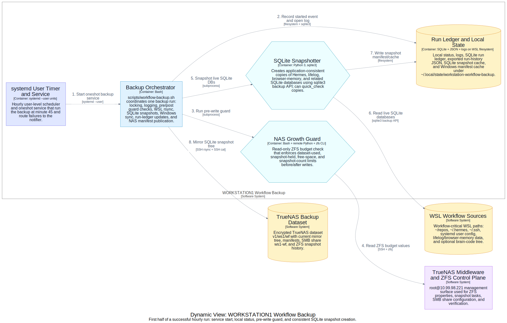

_Preferred Markdown display: Graphviz SVG. Mermaid source is retained below for text review._

Mermaid source

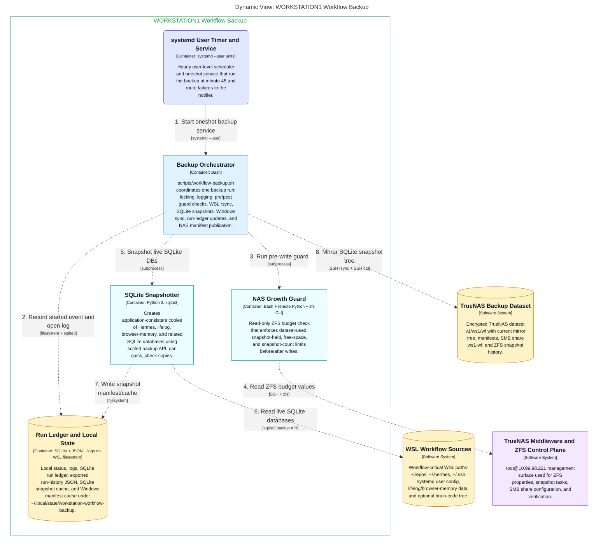

### Derived artifacts

| Artifact | Link |
|---|---|
| Mermaid source | [`structurizr-HourlyPreflightSnapshotFlow.mmd`](diagrams/structurizr-HourlyPreflightSnapshotFlow.mmd) |
| Mermaid SVG | [`structurizr-HourlyPreflightSnapshotFlow.svg`](diagrams/structurizr-HourlyPreflightSnapshotFlow.svg) |
| Mermaid PNG | [`structurizr-HourlyPreflightSnapshotFlow.png`](diagrams/structurizr-HourlyPreflightSnapshotFlow.png) |
| DOT source | [`structurizr-HourlyPreflightSnapshotFlow.dot`](diagrams/dot/structurizr-HourlyPreflightSnapshotFlow.dot) |
| Graphviz SVG | [`structurizr-HourlyPreflightSnapshotFlow.svg`](diagrams/dot-rendered/structurizr-HourlyPreflightSnapshotFlow.svg) |
| Graphviz PNG | [`structurizr-HourlyPreflightSnapshotFlow.png`](diagrams/dot-rendered/structurizr-HourlyPreflightSnapshotFlow.png) |

---

## Local Deployment

> C4 view `LocalDeployment`.

### Diagram

_Preferred Markdown display: Graphviz SVG. Mermaid source is retained below for text review._

Mermaid source

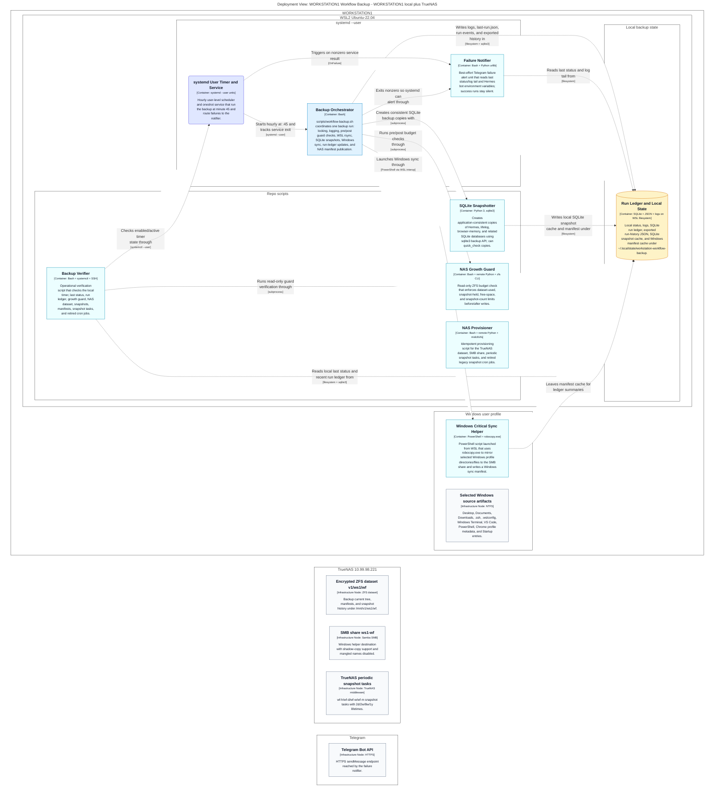

### Derived artifacts

| Artifact | Link |
|---|---|
| Mermaid source | [`structurizr-LocalDeployment.mmd`](diagrams/structurizr-LocalDeployment.mmd) |
| Mermaid SVG | [`structurizr-LocalDeployment.svg`](diagrams/structurizr-LocalDeployment.svg) |
| Mermaid PNG | [`structurizr-LocalDeployment.png`](diagrams/structurizr-LocalDeployment.png) |
| DOT source | [`structurizr-LocalDeployment.dot`](diagrams/dot/structurizr-LocalDeployment.dot) |
| Graphviz SVG | [`structurizr-LocalDeployment.svg`](diagrams/dot-rendered/structurizr-LocalDeployment.svg) |
| Graphviz PNG | [`structurizr-LocalDeployment.png`](diagrams/dot-rendered/structurizr-LocalDeployment.png) |

---

## Ops Provisioning Containers

> C4 view `OpsProvisioningContainers`.

### Diagram

_Preferred Markdown display: Graphviz SVG. Mermaid source is retained below for text review._

Mermaid source

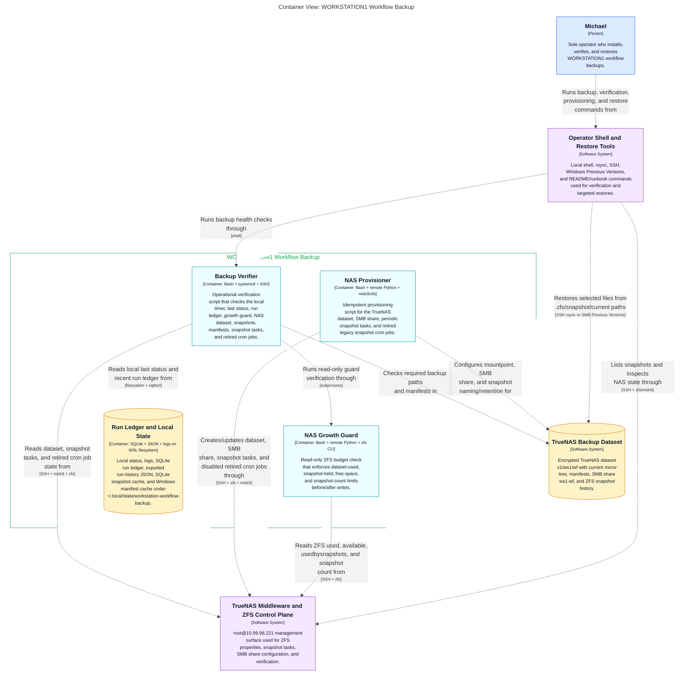

### Derived artifacts

| Artifact | Link |
|---|---|
| Mermaid source | [`structurizr-OpsProvisioningContainers.mmd`](diagrams/structurizr-OpsProvisioningContainers.mmd) |
| Mermaid SVG | [`structurizr-OpsProvisioningContainers.svg`](diagrams/structurizr-OpsProvisioningContainers.svg) |
| Mermaid PNG | [`structurizr-OpsProvisioningContainers.png`](diagrams/structurizr-OpsProvisioningContainers.png) |
| DOT source | [`structurizr-OpsProvisioningContainers.dot`](diagrams/dot/structurizr-OpsProvisioningContainers.dot) |
| Graphviz SVG | [`structurizr-OpsProvisioningContainers.svg`](diagrams/dot-rendered/structurizr-OpsProvisioningContainers.svg) |
| Graphviz PNG | [`structurizr-OpsProvisioningContainers.png`](diagrams/dot-rendered/structurizr-OpsProvisioningContainers.png) |

---

## Orchestrator Control Components

> C4 view `OrchestratorControlComponents`.

### Diagram

_Preferred Markdown display: Graphviz SVG. Mermaid source is retained below for text review._

Mermaid source

```mermaid
graph LR
  linkStyle default fill:#ffffff

  subgraph diagram ["Component View: WORKSTATION1 Workflow Backup - Backup Orchestrator"]
    style diagram fill:#ffffff,stroke:#ffffff

    24[("<div style='font-weight: bold'>TrueNAS Backup Dataset</div><div style='font-size: 70%; margin-top: 0px'>[Software System]</div><div style='font-size: 80%; margin-top:10px'>Encrypted TrueNAS dataset<br />v1/ws1/wf with current mirror<br />tree, manifests, SMB share<br />ws1-wf, and ZFS snapshot<br />history.</div>")]
    style 24 fill:#fef3c7,stroke:#d97706,color:#111827
    25["<div style='font-weight: bold'>TrueNAS Middleware and ZFS Control Plane</div><div style='font-size: 70%; margin-top: 0px'>[Software System]</div><div style='font-size: 80%; margin-top:10px'>root@10.99.98.221 management<br />surface used for ZFS<br />properties, snapshot tasks,<br />SMB share configuration, and<br />verification.</div>"]
    style 25 fill:#f3e8ff,stroke:#9333ea,color:#111827

    subgraph 2 ["WORKSTATION1 Workflow Backup"]
      style 2 fill:#ffffff,stroke:#16a34a,color:#16a34a

      subgraph 4 ["Backup Orchestrator"]
        style 4 fill:#ffffff,stroke:#0284c7,color:#0284c7

        13["<div style='font-weight: bold'>NAS Status Publisher</div><div style='font-size: 70%; margin-top: 0px'>[Component: Python + SSH cat]</div><div style='font-size: 80%; margin-top:10px'>Exports the run ledger to<br />JSON/SQLite snapshots and<br />writes last-run/run-history<br />manifests to NAS.</div>"]
        style 13 fill:#f0fdf4,stroke:#22c55e,color:#111827
        14["<div style='font-weight: bold'>Error Trap</div><div style='font-size: 70%; margin-top: 0px'>[Component: Bash ERR trap]</div><div style='font-size: 80%; margin-top:10px'>Converts command failures<br />into failed status, ledger<br />event, best-effort NAS status<br />sync, and nonzero service<br />exit.</div>"]
        style 14 fill:#f0fdf4,stroke:#22c55e,color:#111827
        5["<div style='font-weight: bold'>Argument Parser</div><div style='font-size: 70%; margin-top: 0px'>[Component: Bash case parser]</div><div style='font-size: 80%; margin-top:10px'>Handles --dry-run, --verbose,<br />--skip-windows, --skip-wsl,<br />and --quick-check-sqlite<br />flags.</div>"]
        style 5 fill:#f0fdf4,stroke:#22c55e,color:#111827
        6["<div style='font-weight: bold'>Lock and Run Identity</div><div style='font-size: 70%; margin-top: 0px'>[Component: Bash + flock]</div><div style='font-size: 80%; margin-top:10px'>Creates the local state/log<br />directories, acquires a flock<br />lock, generates run_id, and<br />skips concurrent runs<br />silently.</div>"]
        style 6 fill:#f0fdf4,stroke:#22c55e,color:#111827
        7["<div style='font-weight: bold'>Log and Last-Status Writer</div><div style='font-size: 70%; margin-top: 0px'>[Component: Bash + Python JSON helper]</div><div style='font-size: 80%; margin-top:10px'>Writes per-run logs and<br />last-run.json with host,<br />status, duration, dry-run,<br />error, and log path.</div>"]
        style 7 fill:#f0fdf4,stroke:#22c55e,color:#111827
        8["<div style='font-weight: bold'>Run Ledger Adapter</div><div style='font-size: 70%; margin-top: 0px'>[Component: record-run-ledger.py CLI]</div><div style='font-size: 80%; margin-top:10px'>Appends<br />started/completed/failed/skipped<br />events with SQLite and<br />Windows manifest summaries.</div>"]
        style 8 fill:#f0fdf4,stroke:#22c55e,color:#111827
        9["<div style='font-weight: bold'>Growth Guard Runner</div><div style='font-size: 70%; margin-top: 0px'>[Component: Bash subprocess]</div><div style='font-size: 80%; margin-top:10px'>Invokes<br />check-nas-growth-guard.sh<br />before and after writes and<br />fails closed on budget<br />violations.</div>"]
        style 9 fill:#f0fdf4,stroke:#22c55e,color:#111827
      end

      17["<div style='font-weight: bold'>NAS Growth Guard</div><div style='font-size: 70%; margin-top: 0px'>[Container: Bash + remote Python + zfs CLI]</div><div style='font-size: 80%; margin-top:10px'>Read-only ZFS budget check<br />that enforces dataset-used,<br />snapshot-held, free-space,<br />and snapshot-count limits<br />before/after writes.</div>"]
      style 17 fill:#ecfeff,stroke:#0891b2,color:#111827
      21[("<div style='font-weight: bold'>Run Ledger and Local State</div><div style='font-size: 70%; margin-top: 0px'>[Container: SQLite + JSON + logs on WSL filesystem]</div><div style='font-size: 80%; margin-top:10px'>Local status, logs, SQLite<br />run ledger, exported<br />run-history JSON, SQLite<br />snapshot cache, and Windows<br />manifest cache under<br />~/.local/state/workstation-workflow-backup.</div>")]
      style 21 fill:#fef3c7,stroke:#d97706,color:#111827
    end

    17-. "<div>Reads ZFS used, available,<br />usedbysnapshots, and snapshot<br />count from</div><div style='font-size: 70%'>[SSH + zfs]</div>" .->25
    5-. "<div>Passes selected run mode to</div><div style='font-size: 70%'></div>" .->6
    6-. "<div>Initializes log and status<br />paths for</div><div style='font-size: 70%'></div>" .->7
    6-. "<div>Records skipped_lock when<br />another run is active</div><div style='font-size: 70%'></div>" .->8
    8-. "<div>Writes run events to</div><div style='font-size: 70%'>[sqlite3]</div>" .->21
    7-. "<div>Writes last-run.json and logs<br />to</div><div style='font-size: 70%'>[filesystem]</div>" .->21
    9-. "<div>Executes guard stages through</div><div style='font-size: 70%'></div>" .->17
    9-. "<div>Stores guard failure message<br />through</div><div style='font-size: 70%'></div>" .->7
    13-. "<div>Snapshots ledger DB and<br />exports run history from</div><div style='font-size: 70%'>[sqlite3]</div>" .->21
    13-. "<div>Publishes<br />_manifests/last-run.json,<br />runs.sqlite3, and<br />run-history.json to</div><div style='font-size: 70%'>[SSH cat]</div>" .->24
    14-. "<div>Marks failed status through</div><div style='font-size: 70%'></div>" .->7
    14-. "<div>Records failed event through</div><div style='font-size: 70%'></div>" .->8
    14-. "<div>Best-effort syncs failure<br />status through</div><div style='font-size: 70%'></div>" .->13

  end
```

### Derived artifacts

| Artifact | Link |
|---|---|
| Mermaid source | [`structurizr-OrchestratorControlComponents.mmd`](diagrams/structurizr-OrchestratorControlComponents.mmd) |
| Mermaid SVG | [`structurizr-OrchestratorControlComponents.svg`](diagrams/structurizr-OrchestratorControlComponents.svg) |
| Mermaid PNG | [`structurizr-OrchestratorControlComponents.png`](diagrams/structurizr-OrchestratorControlComponents.png) |
| DOT source | [`structurizr-OrchestratorControlComponents.dot`](diagrams/dot/structurizr-OrchestratorControlComponents.dot) |
| Graphviz SVG | [`structurizr-OrchestratorControlComponents.svg`](diagrams/dot-rendered/structurizr-OrchestratorControlComponents.svg) |
| Graphviz PNG | [`structurizr-OrchestratorControlComponents.png`](diagrams/dot-rendered/structurizr-OrchestratorControlComponents.png) |

---

## Orchestrator Sync Components

> C4 view `OrchestratorSyncComponents`.

### Diagram

_Preferred Markdown display: Graphviz SVG. Mermaid source is retained below for text review._

Mermaid source

```mermaid
graph LR
  linkStyle default fill:#ffffff

  subgraph diagram ["Component View: WORKSTATION1 Workflow Backup - Backup Orchestrator"]
    style diagram fill:#ffffff,stroke:#ffffff

    22[("<div style='font-weight: bold'>WSL Workflow Sources</div><div style='font-size: 70%; margin-top: 0px'>[Software System]</div><div style='font-size: 80%; margin-top:10px'>Workflow-critical WSL paths:<br />~/repos, ~/.hermes, ~/.ssh,<br />systemd user config,<br />lifelog/browser-memory data,<br />and optional brain-code tree.</div>")]
    style 22 fill:#fef3c7,stroke:#d97706,color:#111827
    23[("<div style='font-weight: bold'>Windows Workflow Sources</div><div style='font-size: 70%; margin-top: 0px'>[Software System]</div><div style='font-size: 80%; margin-top:10px'>Selected Windows user-profile<br />artifacts: Desktop,<br />Documents, Downloads, Windows<br />.ssh/.wslconfig, Terminal/VS<br />Code/PowerShell config,<br />Chrome profile metadata, and<br />Startup entries.</div>")]
    style 23 fill:#fef3c7,stroke:#d97706,color:#111827
    24[("<div style='font-weight: bold'>TrueNAS Backup Dataset</div><div style='font-size: 70%; margin-top: 0px'>[Software System]</div><div style='font-size: 80%; margin-top:10px'>Encrypted TrueNAS dataset<br />v1/ws1/wf with current mirror<br />tree, manifests, SMB share<br />ws1-wf, and ZFS snapshot<br />history.</div>")]
    style 24 fill:#fef3c7,stroke:#d97706,color:#111827

    subgraph 2 ["WORKSTATION1 Workflow Backup"]
      style 2 fill:#ffffff,stroke:#16a34a,color:#16a34a

      subgraph 4 ["Backup Orchestrator"]
        style 4 fill:#ffffff,stroke:#0284c7,color:#0284c7

        10["<div style='font-weight: bold'>SQLite Snapshot Phase</div><div style='font-size: 70%; margin-top: 0px'>[Component: Python subprocess + rsync]</div><div style='font-size: 80%; margin-top:10px'>Runs the SQLite backup API<br />snapshotter and mirrors the<br />consistent DB snapshot tree<br />to NAS.</div>"]
        style 10 fill:#f0fdf4,stroke:#22c55e,color:#111827
        11["<div style='font-weight: bold'>WSL Rsync Phase</div><div style='font-size: 70%; margin-top: 0px'>[Component: rsync over SSH]</div><div style='font-size: 80%; margin-top:10px'>Mirrors configured WSL<br />directories to current/wsl<br />using sudo rsync over SSH<br />with payload exclusions.</div>"]
        style 11 fill:#f0fdf4,stroke:#22c55e,color:#111827
        12["<div style='font-weight: bold'>Windows Phase Launcher</div><div style='font-size: 70%; margin-top: 0px'>[Component: Bash + WSL interop]</div><div style='font-size: 80%; margin-top:10px'>Copies the PowerShell helper<br />to Windows temp and launches<br />it through direct WSL interop<br />or /init fallback.</div>"]
        style 12 fill:#f0fdf4,stroke:#22c55e,color:#111827
      end

      15["<div style='font-weight: bold'>SQLite Snapshotter</div><div style='font-size: 70%; margin-top: 0px'>[Container: Python 3, sqlite3]</div><div style='font-size: 80%; margin-top:10px'>Creates<br />application-consistent copies<br />of Hermes, lifelog,<br />browser-memory, and related<br />SQLite databases using<br />sqlite3 backup API; can<br />quick_check copies.</div>"]
      style 15 fill:#ecfeff,stroke:#0891b2,color:#111827
      16["<div style='font-weight: bold'>Windows Critical Sync Helper</div><div style='font-size: 70%; margin-top: 0px'>[Container: PowerShell + robocopy.exe]</div><div style='font-size: 80%; margin-top:10px'>PowerShell script launched<br />from WSL that uses<br />robocopy.exe to mirror<br />selected Windows profile<br />directories/files to the SMB<br />share and writes a Windows<br />sync manifest.</div>"]
      style 16 fill:#ecfeff,stroke:#0891b2,color:#111827
      21[("<div style='font-weight: bold'>Run Ledger and Local State</div><div style='font-size: 70%; margin-top: 0px'>[Container: SQLite + JSON + logs on WSL filesystem]</div><div style='font-size: 80%; margin-top:10px'>Local status, logs, SQLite<br />run ledger, exported<br />run-history JSON, SQLite<br />snapshot cache, and Windows<br />manifest cache under<br />~/.local/state/workstation-workflow-backup.</div>")]
      style 21 fill:#fef3c7,stroke:#d97706,color:#111827
    end

    15-. "<div>Reads live SQLite databases<br />from</div><div style='font-size: 70%'>[sqlite3 backup API]</div>" .->22
    15-. "<div>Writes local SQLite snapshot<br />cache and manifest under</div><div style='font-size: 70%'>[filesystem]</div>" .->21
    16-. "<div>Mirrors selected Windows<br />artifacts from</div><div style='font-size: 70%'>[robocopy.exe]</div>" .->23
    16-. "<div>Writes current/windows and<br />Windows manifests to</div><div style='font-size: 70%'>[SMB \\10.99.98.221\\ws1-wf]</div>" .->24
    16-. "<div>Leaves manifest cache for<br />ledger summaries</div><div style='font-size: 70%'></div>" .->21
    10-. "<div>Creates consistent DB<br />snapshot tree through</div><div style='font-size: 70%'></div>" .->15
    10-. "<div>Mirrors DB snapshot tree to</div><div style='font-size: 70%'>[rsync]</div>" .->24
    11-. "<div>Reads configured WSL paths<br />from</div><div style='font-size: 70%'>[filesystem]</div>" .->22
    11-. "<div>Mirrors WSL trees to</div><div style='font-size: 70%'>[rsync over SSH]</div>" .->24
    12-. "<div>Launches and monitors</div><div style='font-size: 70%'>[PowerShell]</div>" .->16
    12-. "<div>Uses SMB root for Windows<br />helper destination</div><div style='font-size: 70%'></div>" .->24

  end
```

### Derived artifacts

| Artifact | Link |
|---|---|
| Mermaid source | [`structurizr-OrchestratorSyncComponents.mmd`](diagrams/structurizr-OrchestratorSyncComponents.mmd) |
| Mermaid SVG | [`structurizr-OrchestratorSyncComponents.svg`](diagrams/structurizr-OrchestratorSyncComponents.svg) |
| Mermaid PNG | [`structurizr-OrchestratorSyncComponents.png`](diagrams/structurizr-OrchestratorSyncComponents.png) |
| DOT source | [`structurizr-OrchestratorSyncComponents.dot`](diagrams/dot/structurizr-OrchestratorSyncComponents.dot) |
| Graphviz SVG | [`structurizr-OrchestratorSyncComponents.svg`](diagrams/dot-rendered/structurizr-OrchestratorSyncComponents.svg) |
| Graphviz PNG | [`structurizr-OrchestratorSyncComponents.png`](diagrams/dot-rendered/structurizr-OrchestratorSyncComponents.png) |

---

## System Context

> C4 view `SystemContext`.

### Diagram

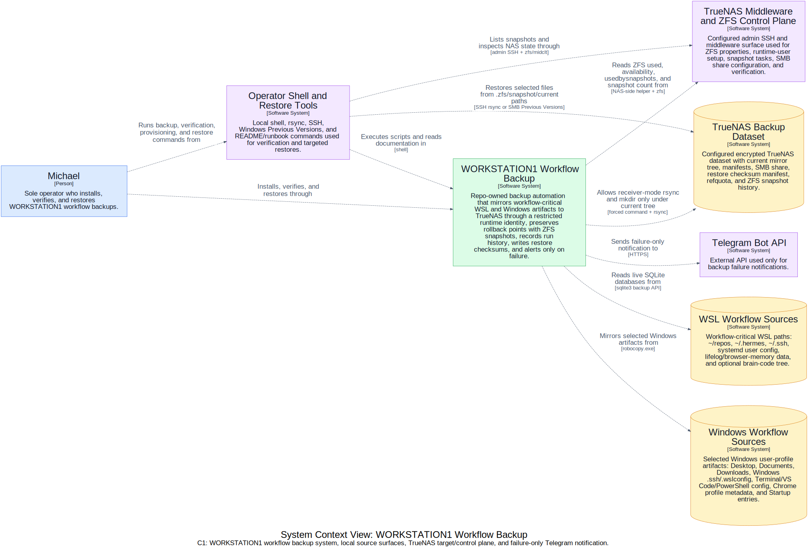

_Preferred Markdown display: Graphviz SVG. Mermaid source is retained below for text review._

Mermaid source

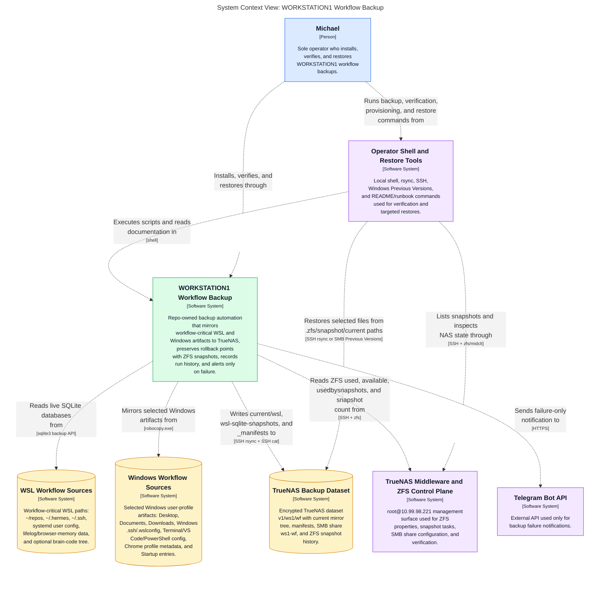

### Derived artifacts

| Artifact | Link |
|---|---|
| Mermaid source | [`structurizr-SystemContext.mmd`](diagrams/structurizr-SystemContext.mmd) |
| Mermaid SVG | [`structurizr-SystemContext.svg`](diagrams/structurizr-SystemContext.svg) |
| Mermaid PNG | [`structurizr-SystemContext.png`](diagrams/structurizr-SystemContext.png) |
| DOT source | [`structurizr-SystemContext.dot`](diagrams/dot/structurizr-SystemContext.dot) |
| Graphviz SVG | [`structurizr-SystemContext.svg`](diagrams/dot-rendered/structurizr-SystemContext.svg) |
| Graphviz PNG | [`structurizr-SystemContext.png`](diagrams/dot-rendered/structurizr-SystemContext.png) |

---

## Targeted Restore Flow

> C4 view `TargetedRestoreFlow`.

### Diagram

_Preferred Markdown display: Graphviz SVG. Mermaid source is retained below for text review._

Mermaid source

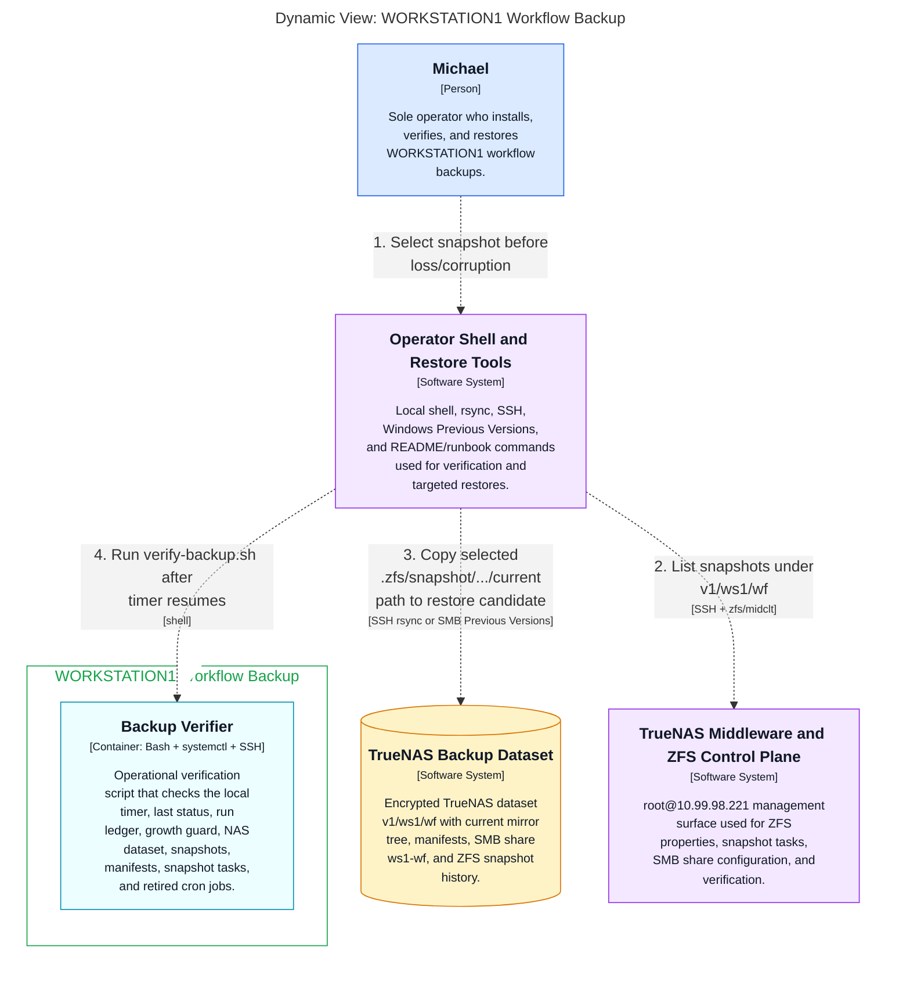

### Derived artifacts

| Artifact | Link |
|---|---|
| Mermaid source | [`structurizr-TargetedRestoreFlow.mmd`](diagrams/structurizr-TargetedRestoreFlow.mmd) |
| Mermaid SVG | [`structurizr-TargetedRestoreFlow.svg`](diagrams/structurizr-TargetedRestoreFlow.svg) |
| Mermaid PNG | [`structurizr-TargetedRestoreFlow.png`](diagrams/structurizr-TargetedRestoreFlow.png) |
| DOT source | [`structurizr-TargetedRestoreFlow.dot`](diagrams/dot/structurizr-TargetedRestoreFlow.dot) |
| Graphviz SVG | [`structurizr-TargetedRestoreFlow.svg`](diagrams/dot-rendered/structurizr-TargetedRestoreFlow.svg) |
| Graphviz PNG | [`structurizr-TargetedRestoreFlow.png`](diagrams/dot-rendered/structurizr-TargetedRestoreFlow.png) |
