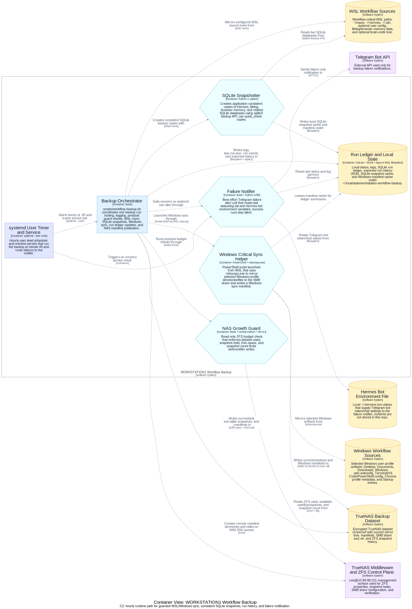

# Backup Runtime Containers

> Generated Markdown wrapper for C4 view `BackupRuntimeContainers`. Canonical model: [`workspace.dsl`](../../workspace.dsl).

<!-- Generated from Structurizr exports; refresh from docs/architecture/workspace.dsl. -->

## Diagram

_Preferred Markdown display: Graphviz SVG. Mermaid source is retained below for text review._

```mermaid
graph LR
  linkStyle default fill:#ffffff

  subgraph diagram ["Container View: WORKSTATION1 Workflow Backup"]
    style diagram fill:#ffffff,stroke:#ffffff

    26[("<div style='font-weight: bold'>WSL Workflow Sources</div><div style='font-size: 70%; margin-top: 0px'>[Software System]</div><div style='font-size: 80%; margin-top:10px'>Workflow-critical WSL paths:<br />~/repos, ~/.hermes, ~/.ssh,<br />systemd user config,<br />lifelog/browser-memory data,<br />and optional brain-code tree.</div>")]
    style 26 fill:#fef3c7,stroke:#d97706,color:#111827
    27[("<div style='font-weight: bold'>Windows Workflow Sources</div><div style='font-size: 70%; margin-top: 0px'>[Software System]</div><div style='font-size: 80%; margin-top:10px'>Selected Windows user-profile<br />artifacts: Desktop,<br />Documents, Downloads, Windows<br />.ssh/.wslconfig, Terminal/VS<br />Code/PowerShell config,<br />Chrome profile metadata, and<br />Startup entries.</div>")]
    style 27 fill:#fef3c7,stroke:#d97706,color:#111827
    28[("<div style='font-weight: bold'>TrueNAS Backup Dataset</div><div style='font-size: 70%; margin-top: 0px'>[Software System]</div><div style='font-size: 80%; margin-top:10px'>Configured encrypted TrueNAS<br />dataset with current mirror<br />tree, manifests, SMB share,<br />restore checksum manifest,<br />refquota, and ZFS snapshot<br />history.</div>")]
    style 28 fill:#fef3c7,stroke:#d97706,color:#111827
    29["<div style='font-weight: bold'>TrueNAS Middleware and ZFS Control Plane</div><div style='font-size: 70%; margin-top: 0px'>[Software System]</div><div style='font-size: 80%; margin-top:10px'>Configured admin SSH and<br />middleware surface used for<br />ZFS properties, runtime-user<br />setup, snapshot tasks, SMB<br />share configuration, and<br />verification.</div>"]
    style 29 fill:#f3e8ff,stroke:#9333ea,color:#111827
    30[("<div style='font-weight: bold'>Hermes Bot Environment File</div><div style='font-size: 70%; margin-top: 0px'>[Software System]</div><div style='font-size: 80%; margin-top:10px'>Local ~/.hermes/.env values<br />that supply Telegram bot<br />token/chat settings to the<br />failure notifier; contents<br />are not stored in this repo.</div>")]
    style 30 fill:#fef3c7,stroke:#d97706,color:#111827
    31["<div style='font-weight: bold'>Telegram Bot API</div><div style='font-size: 70%; margin-top: 0px'>[Software System]</div><div style='font-size: 80%; margin-top:10px'>External API used only for<br />backup failure notifications.</div>"]
    style 31 fill:#f3e8ff,stroke:#9333ea,color:#111827

    subgraph 2 ["WORKSTATION1 Workflow Backup"]
      style 2 fill:#ffffff,stroke:#16a34a,color:#16a34a

      16["<div style='font-weight: bold'>SQLite Snapshotter</div><div style='font-size: 70%; margin-top: 0px'>[Container: Python 3, sqlite3]</div><div style='font-size: 80%; margin-top:10px'>Creates<br />application-consistent copies<br />of Hermes, lifelog,<br />browser-memory, and related<br />SQLite databases using<br />sqlite3 backup API; can<br />quick_check copies.</div>"]
      style 16 fill:#ecfeff,stroke:#0891b2,color:#111827
      17["<div style='font-weight: bold'>Windows Critical Sync Helper</div><div style='font-size: 70%; margin-top: 0px'>[Container: PowerShell + robocopy.exe]</div><div style='font-size: 80%; margin-top:10px'>PowerShell script launched<br />from WSL that uses<br />robocopy.exe to mirror<br />selected Windows profile<br />directories/files to the SMB<br />share and writes a Windows<br />sync manifest.</div>"]
      style 17 fill:#ecfeff,stroke:#0891b2,color:#111827
      18["<div style='font-weight: bold'>NAS Growth Guard</div><div style='font-size: 70%; margin-top: 0px'>[Container: Bash + NAS sudo helper + zfs CLI]</div><div style='font-size: 80%; margin-top:10px'>Read-only NAS-side ZFS budget<br />check that enforces<br />dataset-used, snapshot-held,<br />availability-dataset<br />free-space, and<br />snapshot-count limits<br />before/after writes.</div>"]
      style 18 fill:#ecfeff,stroke:#0891b2,color:#111827
      19["<div style='font-weight: bold'>NAS Integrity Manifest Builder</div><div style='font-size: 70%; margin-top: 0px'>[Container: Python + SHA-256]</div><div style='font-size: 80%; margin-top:10px'>NAS-side helper that hashes<br />restore-critical current-tree<br />artifacts and writes<br />_manifests/integrity-manifest.json<br />for snapshot-preserved<br />restore verification.</div>"]
      style 19 fill:#ecfeff,stroke:#0891b2,color:#111827
      20["<div style='font-weight: bold'>Restricted NAS Runtime SSH Boundary</div><div style='font-size: 70%; margin-top: 0px'>[Container: OpenSSH forced command + sudoers + ZFS refquota]</div><div style='font-size: 80%; margin-top:10px'>Dedicated runtime NAS<br />user/key, pinned host-key<br />verification, forced-command<br />dispatcher, sudo allowlist,<br />and refquota-backed<br />current-tree write boundary.</div>"]
      style 20 fill:#ecfeff,stroke:#0891b2,color:#111827
      24["<div style='font-weight: bold'>Failure Notifier</div><div style='font-size: 70%; margin-top: 0px'>[Container: Bash + Python urllib]</div><div style='font-size: 80%; margin-top:10px'>Best-effort Telegram failure<br />alert unit that reads last<br />status/log tail and Hermes<br />bot environment variables;<br />success runs stay silent.</div>"]
      style 24 fill:#ecfeff,stroke:#0891b2,color:#111827
      25[("<div style='font-weight: bold'>Run Ledger and Local State</div><div style='font-size: 70%; margin-top: 0px'>[Container: SQLite + JSON + logs on WSL filesystem]</div><div style='font-size: 80%; margin-top:10px'>Local status, pruned logs,<br />SQLite run ledger, exported<br />run-history JSON, SQLite<br />snapshot cache, and Windows<br />manifest cache under<br />~/.local/state/workstation-workflow-backup.</div>")]
      style 25 fill:#fef3c7,stroke:#d97706,color:#111827
      3("<div style='font-weight: bold'>systemd User Timer and Service</div><div style='font-size: 70%; margin-top: 0px'>[Container: systemd --user units]</div><div style='font-size: 80%; margin-top:10px'>Hourly user-level scheduler<br />and oneshot service that run<br />the backup at minute 45 and<br />route failures to the<br />notifier.</div>")
      style 3 fill:#e0e7ff,stroke:#4f46e5,color:#111827
      4["<div style='font-weight: bold'>Backup Orchestrator</div><div style='font-size: 70%; margin-top: 0px'>[Container: Bash]</div><div style='font-size: 80%; margin-top:10px'>scripts/workflow-backup.sh<br />coordinates one backup run:<br />locking, log pruning,<br />pre/post guard checks, WSL<br />rsync, SQLite snapshots,<br />Windows sync, strict final<br />ledger updates, NAS manifest<br />publication, and<br />restore-checksum generation.</div>"]
      style 4 fill:#e0f2fe,stroke:#0284c7,color:#111827
    end

    3-. "<div>Starts hourly at :45 and<br />tracks service exit</div><div style='font-size: 70%'>[systemd --user]</div>" .->4
    3-. "<div>Triggers on nonzero service<br />result</div><div style='font-size: 70%'>[OnFailure]</div>" .->24
    4-. "<div>Writes logs, last-run.json,<br />run events, and exported<br />history in</div><div style='font-size: 70%'>[filesystem + sqlite3]</div>" .->25
    4-. "<div>Runs pre/post budget checks<br />through</div><div style='font-size: 70%'>[subprocess]</div>" .->18
    18-. "<div>Reads ZFS used, availability,<br />usedbysnapshots, and snapshot<br />count from</div><div style='font-size: 70%'>[NAS-side helper + zfs]</div>" .->29
    4-. "<div>Creates consistent SQLite<br />backup copies with</div><div style='font-size: 70%'>[subprocess]</div>" .->16
    16-. "<div>Reads live SQLite databases<br />from</div><div style='font-size: 70%'>[sqlite3 backup API]</div>" .->26
    16-. "<div>Writes local SQLite snapshot<br />cache and manifest under</div><div style='font-size: 70%'>[filesystem]</div>" .->25
    4-. "<div>Mirrors configured WSL source<br />trees from</div><div style='font-size: 70%'>[sudo rsync]</div>" .->26
    4-. "<div>Connects with dedicated<br />runtime key and pinned<br />host-key verification through</div><div style='font-size: 70%'>[SSH]</div>" .->20
    20-. "<div>Allows receiver-mode rsync<br />and mkdir only under current<br />tree</div><div style='font-size: 70%'>[forced command + rsync]</div>" .->28
    20-. "<div>Allows sudo execution of<br />guard helper only</div><div style='font-size: 70%'>[forced command + sudo]</div>" .->18
    20-. "<div>Allows sudo execution of<br />integrity helper only</div><div style='font-size: 70%'>[forced command + sudo]</div>" .->19
    4-. "<div>Writes current/wsl,<br />wsl-sqlite-snapshots, and<br />_manifests to</div><div style='font-size: 70%'>[restricted SSH rsync]</div>" .->28
    4-. "<div>Launches Windows sync through</div><div style='font-size: 70%'>[PowerShell via WSL interop]</div>" .->17
    17-. "<div>Mirrors selected Windows<br />artifacts from</div><div style='font-size: 70%'>[robocopy.exe]</div>" .->27
    17-. "<div>Writes current/windows and<br />Windows manifests to</div><div style='font-size: 70%'>[SMB share]</div>" .->28
    17-. "<div>Leaves manifest cache for<br />ledger summaries</div><div style='font-size: 70%'></div>" .->25
    4-. "<div>Runs restore-critical<br />checksum manifest generation<br />through</div><div style='font-size: 70%'>[restricted SSH]</div>" .->19
    19-. "<div>Hashes NAS current-tree<br />critical artifacts and writes<br />integrity-manifest.json to</div><div style='font-size: 70%'>[SHA-256 + filesystem]</div>" .->28
    4-. "<div>Exits nonzero so systemd can<br />alert through</div><div style='font-size: 70%'></div>" .->24
    24-. "<div>Reads last status and log<br />tail from</div><div style='font-size: 70%'>[filesystem]</div>" .->25
    24-. "<div>Reads Telegram bot token/chat<br />values from</div><div style='font-size: 70%'>[filesystem]</div>" .->30
    24-. "<div>Sends failure-only<br />notification to</div><div style='font-size: 70%'>[HTTPS]</div>" .->31

  end
```

Mermaid source

## Derived artifacts

| Artifact | Link |
|---|---|
| Mermaid source | [`structurizr-BackupRuntimeContainers.mmd`](../structurizr-BackupRuntimeContainers.mmd) |
| Mermaid SVG | [`structurizr-BackupRuntimeContainers.svg`](../structurizr-BackupRuntimeContainers.svg) |
| Mermaid PNG | [`structurizr-BackupRuntimeContainers.png`](../structurizr-BackupRuntimeContainers.png) |
| DOT source | [`structurizr-BackupRuntimeContainers.dot`](../dot/structurizr-BackupRuntimeContainers.dot) |
| Graphviz SVG | [`structurizr-BackupRuntimeContainers.svg`](../dot-rendered/structurizr-BackupRuntimeContainers.svg) |
| Graphviz PNG | [`structurizr-BackupRuntimeContainers.png`](../dot-rendered/structurizr-BackupRuntimeContainers.png) |
