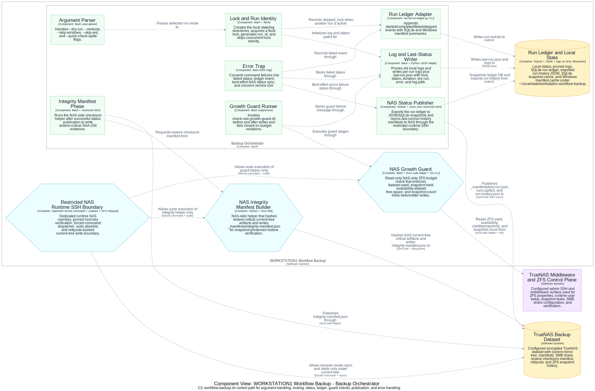

# Orchestrator Control Components

> Generated Markdown wrapper for C4 view `OrchestratorControlComponents`. Canonical model: [`workspace.dsl`](../../workspace.dsl).

<!-- Generated from Structurizr exports; refresh from docs/architecture/workspace.dsl. -->

## Diagram

_Preferred Markdown display: Graphviz SVG. Mermaid source is retained below for text review._

```mermaid
graph LR
  linkStyle default fill:#ffffff

  subgraph diagram ["Component View: WORKSTATION1 Workflow Backup - Backup Orchestrator"]
    style diagram fill:#ffffff,stroke:#ffffff

    28[("<div style='font-weight: bold'>TrueNAS Backup Dataset</div><div style='font-size: 70%; margin-top: 0px'>[Software System]</div><div style='font-size: 80%; margin-top:10px'>Configured encrypted TrueNAS<br />dataset with current mirror<br />tree, manifests, SMB share,<br />restore checksum manifest,<br />refquota, and ZFS snapshot<br />history.</div>")]
    style 28 fill:#fef3c7,stroke:#d97706,color:#111827
    29["<div style='font-weight: bold'>TrueNAS Middleware and ZFS Control Plane</div><div style='font-size: 70%; margin-top: 0px'>[Software System]</div><div style='font-size: 80%; margin-top:10px'>Configured admin SSH and<br />middleware surface used for<br />ZFS properties, runtime-user<br />setup, snapshot tasks, SMB<br />share configuration, and<br />verification.</div>"]
    style 29 fill:#f3e8ff,stroke:#9333ea,color:#111827

    subgraph 2 ["WORKSTATION1 Workflow Backup"]
      style 2 fill:#ffffff,stroke:#16a34a,color:#16a34a

      subgraph 4 ["Backup Orchestrator"]
        style 4 fill:#ffffff,stroke:#0284c7,color:#0284c7

        13["<div style='font-weight: bold'>NAS Status Publisher</div><div style='font-size: 70%; margin-top: 0px'>[Component: Python + rsync over restricted SSH]</div><div style='font-size: 80%; margin-top:10px'>Exports the run ledger to<br />JSON/SQLite snapshots and<br />rsyncs last-run/run-history<br />manifests to NAS through the<br />restricted runtime SSH<br />boundary.</div>"]
        style 13 fill:#f0fdf4,stroke:#22c55e,color:#111827
        14["<div style='font-weight: bold'>Integrity Manifest Phase</div><div style='font-size: 70%; margin-top: 0px'>[Component: Bash + restricted SSH]</div><div style='font-size: 80%; margin-top:10px'>Runs the NAS-side checksum<br />helper after successful<br />status publication to write<br />restore-critical SHA-256<br />evidence.</div>"]
        style 14 fill:#f0fdf4,stroke:#22c55e,color:#111827
        15["<div style='font-weight: bold'>Error Trap</div><div style='font-size: 70%; margin-top: 0px'>[Component: Bash ERR trap]</div><div style='font-size: 80%; margin-top:10px'>Converts command failures<br />into failed status, ledger<br />event, best-effort NAS status<br />sync, and nonzero service<br />exit.</div>"]
        style 15 fill:#f0fdf4,stroke:#22c55e,color:#111827
        5["<div style='font-weight: bold'>Argument Parser</div><div style='font-size: 70%; margin-top: 0px'>[Component: Bash case parser]</div><div style='font-size: 80%; margin-top:10px'>Handles --dry-run, --verbose,<br />--skip-windows, --skip-wsl,<br />and --quick-check-sqlite<br />flags.</div>"]
        style 5 fill:#f0fdf4,stroke:#22c55e,color:#111827
        6["<div style='font-weight: bold'>Lock and Run Identity</div><div style='font-size: 70%; margin-top: 0px'>[Component: Bash + flock]</div><div style='font-size: 80%; margin-top:10px'>Creates the local state/log<br />directories, acquires a flock<br />lock, generates run_id, and<br />skips concurrent runs<br />silently.</div>"]
        style 6 fill:#f0fdf4,stroke:#22c55e,color:#111827
        7["<div style='font-weight: bold'>Log and Last-Status Writer</div><div style='font-size: 70%; margin-top: 0px'>[Component: Bash + Python JSON helper]</div><div style='font-size: 80%; margin-top:10px'>Prunes old local logs and<br />writes per-run logs plus<br />last-run.json with host,<br />status, duration, dry-run,<br />error, and log path.</div>"]
        style 7 fill:#f0fdf4,stroke:#22c55e,color:#111827
        8["<div style='font-weight: bold'>Run Ledger Adapter</div><div style='font-size: 70%; margin-top: 0px'>[Component: record-run-ledger.py CLI]</div><div style='font-size: 80%; margin-top:10px'>Appends<br />started/completed/failed/skipped<br />events with SQLite and<br />Windows manifest summaries.</div>"]
        style 8 fill:#f0fdf4,stroke:#22c55e,color:#111827
        9["<div style='font-weight: bold'>Growth Guard Runner</div><div style='font-size: 70%; margin-top: 0px'>[Component: Bash subprocess]</div><div style='font-size: 80%; margin-top:10px'>Invokes<br />check-nas-growth-guard.sh<br />before and after writes and<br />fails closed on budget<br />violations.</div>"]
        style 9 fill:#f0fdf4,stroke:#22c55e,color:#111827
      end

      18["<div style='font-weight: bold'>NAS Growth Guard</div><div style='font-size: 70%; margin-top: 0px'>[Container: Bash + NAS sudo helper + zfs CLI]</div><div style='font-size: 80%; margin-top:10px'>Read-only NAS-side ZFS budget<br />check that enforces<br />dataset-used, snapshot-held,<br />availability-dataset<br />free-space, and<br />snapshot-count limits<br />before/after writes.</div>"]
      style 18 fill:#ecfeff,stroke:#0891b2,color:#111827
      19["<div style='font-weight: bold'>NAS Integrity Manifest Builder</div><div style='font-size: 70%; margin-top: 0px'>[Container: Python + SHA-256]</div><div style='font-size: 80%; margin-top:10px'>NAS-side helper that hashes<br />restore-critical current-tree<br />artifacts and writes<br />_manifests/integrity-manifest.json<br />for snapshot-preserved<br />restore verification.</div>"]
      style 19 fill:#ecfeff,stroke:#0891b2,color:#111827
      20["<div style='font-weight: bold'>Restricted NAS Runtime SSH Boundary</div><div style='font-size: 70%; margin-top: 0px'>[Container: OpenSSH forced command + sudoers + ZFS refquota]</div><div style='font-size: 80%; margin-top:10px'>Dedicated runtime NAS<br />user/key, pinned host-key<br />verification, forced-command<br />dispatcher, sudo allowlist,<br />and refquota-backed<br />current-tree write boundary.</div>"]
      style 20 fill:#ecfeff,stroke:#0891b2,color:#111827
      25[("<div style='font-weight: bold'>Run Ledger and Local State</div><div style='font-size: 70%; margin-top: 0px'>[Container: SQLite + JSON + logs on WSL filesystem]</div><div style='font-size: 80%; margin-top:10px'>Local status, pruned logs,<br />SQLite run ledger, exported<br />run-history JSON, SQLite<br />snapshot cache, and Windows<br />manifest cache under<br />~/.local/state/workstation-workflow-backup.</div>")]
      style 25 fill:#fef3c7,stroke:#d97706,color:#111827
    end

    18-. "<div>Reads ZFS used, availability,<br />usedbysnapshots, and snapshot<br />count from</div><div style='font-size: 70%'>[NAS-side helper + zfs]</div>" .->29
    20-. "<div>Allows receiver-mode rsync<br />and mkdir only under current<br />tree</div><div style='font-size: 70%'>[forced command + rsync]</div>" .->28
    20-. "<div>Allows sudo execution of<br />guard helper only</div><div style='font-size: 70%'>[forced command + sudo]</div>" .->18
    20-. "<div>Allows sudo execution of<br />integrity helper only</div><div style='font-size: 70%'>[forced command + sudo]</div>" .->19
    19-. "<div>Hashes NAS current-tree<br />critical artifacts and writes<br />integrity-manifest.json to</div><div style='font-size: 70%'>[SHA-256 + filesystem]</div>" .->28
    5-. "<div>Passes selected run mode to</div><div style='font-size: 70%'></div>" .->6
    6-. "<div>Initializes log and status<br />paths for</div><div style='font-size: 70%'></div>" .->7
    6-. "<div>Records skipped_lock when<br />another run is active</div><div style='font-size: 70%'></div>" .->8
    8-. "<div>Writes run events to</div><div style='font-size: 70%'>[sqlite3]</div>" .->25
    7-. "<div>Writes last-run.json and logs<br />to</div><div style='font-size: 70%'>[filesystem]</div>" .->25
    9-. "<div>Executes guard stages through</div><div style='font-size: 70%'></div>" .->18
    9-. "<div>Stores guard failure message<br />through</div><div style='font-size: 70%'></div>" .->7
    13-. "<div>Snapshots ledger DB and<br />exports run history from</div><div style='font-size: 70%'>[sqlite3]</div>" .->25
    13-. "<div>Publishes<br />_manifests/last-run.json,<br />runs.sqlite3, and<br />run-history.json to</div><div style='font-size: 70%'>[restricted SSH rsync]</div>" .->28
    14-. "<div>Requests restore checksum<br />manifest from</div><div style='font-size: 70%'></div>" .->19
    14-. "<div>Publishes<br />integrity-manifest.json<br />through</div><div style='font-size: 70%'>[NAS-side helper]</div>" .->28
    15-. "<div>Marks failed status through</div><div style='font-size: 70%'></div>" .->7
    15-. "<div>Records failed event through</div><div style='font-size: 70%'></div>" .->8
    15-. "<div>Best-effort syncs failure<br />status through</div><div style='font-size: 70%'></div>" .->13

  end
```

Mermaid source

## Derived artifacts

| Artifact | Link |
|---|---|
| Mermaid source | [`structurizr-OrchestratorControlComponents.mmd`](../structurizr-OrchestratorControlComponents.mmd) |
| Mermaid SVG | [`structurizr-OrchestratorControlComponents.svg`](../structurizr-OrchestratorControlComponents.svg) |
| Mermaid PNG | [`structurizr-OrchestratorControlComponents.png`](../structurizr-OrchestratorControlComponents.png) |
| DOT source | [`structurizr-OrchestratorControlComponents.dot`](../dot/structurizr-OrchestratorControlComponents.dot) |
| Graphviz SVG | [`structurizr-OrchestratorControlComponents.svg`](../dot-rendered/structurizr-OrchestratorControlComponents.svg) |
| Graphviz PNG | [`structurizr-OrchestratorControlComponents.png`](../dot-rendered/structurizr-OrchestratorControlComponents.png) |
