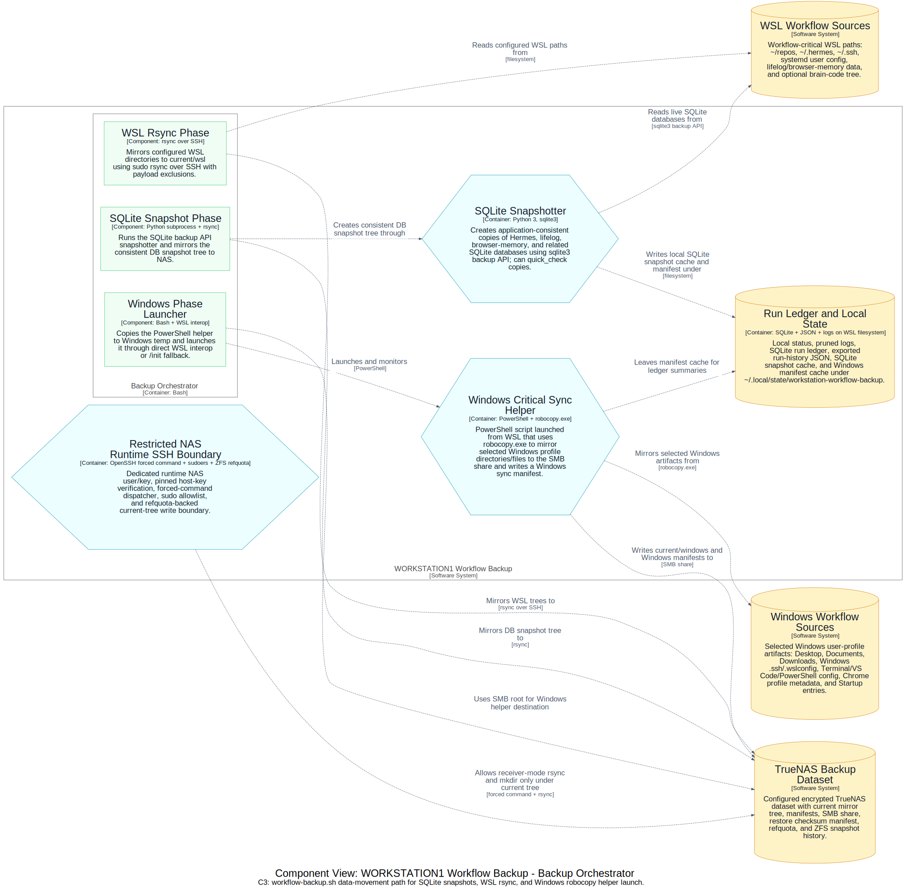

# Orchestrator Sync Components

> Generated Markdown wrapper for C4 view `OrchestratorSyncComponents`. Canonical model: [`workspace.dsl`](../../workspace.dsl).

<!-- Generated from Structurizr exports; refresh from docs/architecture/workspace.dsl. -->

## Diagram

_Preferred Markdown display: Graphviz SVG. Mermaid source is retained below for text review._

```mermaid
graph LR
  linkStyle default fill:#ffffff

  subgraph diagram ["Component View: WORKSTATION1 Workflow Backup - Backup Orchestrator"]
    style diagram fill:#ffffff,stroke:#ffffff

    22[("<div style='font-weight: bold'>WSL Workflow Sources</div><div style='font-size: 70%; margin-top: 0px'>[Software System]</div><div style='font-size: 80%; margin-top:10px'>Workflow-critical WSL paths:<br />~/repos, ~/.hermes, ~/.ssh,<br />systemd user config,<br />lifelog/browser-memory data,<br />and optional brain-code tree.</div>")]
    style 22 fill:#fef3c7,stroke:#d97706,color:#111827
    23[("<div style='font-weight: bold'>Windows Workflow Sources</div><div style='font-size: 70%; margin-top: 0px'>[Software System]</div><div style='font-size: 80%; margin-top:10px'>Selected Windows user-profile<br />artifacts: Desktop,<br />Documents, Downloads, Windows<br />.ssh/.wslconfig, Terminal/VS<br />Code/PowerShell config,<br />Chrome profile metadata, and<br />Startup entries.</div>")]
    style 23 fill:#fef3c7,stroke:#d97706,color:#111827
    24[("<div style='font-weight: bold'>TrueNAS Backup Dataset</div><div style='font-size: 70%; margin-top: 0px'>[Software System]</div><div style='font-size: 80%; margin-top:10px'>Encrypted TrueNAS dataset<br />v1/ws1/wf with current mirror<br />tree, manifests, SMB share<br />ws1-wf, and ZFS snapshot<br />history.</div>")]
    style 24 fill:#fef3c7,stroke:#d97706,color:#111827

    subgraph 2 ["WORKSTATION1 Workflow Backup"]
      style 2 fill:#ffffff,stroke:#16a34a,color:#16a34a

      subgraph 4 ["Backup Orchestrator"]
        style 4 fill:#ffffff,stroke:#0284c7,color:#0284c7

        10["<div style='font-weight: bold'>SQLite Snapshot Phase</div><div style='font-size: 70%; margin-top: 0px'>[Component: Python subprocess + rsync]</div><div style='font-size: 80%; margin-top:10px'>Runs the SQLite backup API<br />snapshotter and mirrors the<br />consistent DB snapshot tree<br />to NAS.</div>"]
        style 10 fill:#f0fdf4,stroke:#22c55e,color:#111827
        11["<div style='font-weight: bold'>WSL Rsync Phase</div><div style='font-size: 70%; margin-top: 0px'>[Component: rsync over SSH]</div><div style='font-size: 80%; margin-top:10px'>Mirrors configured WSL<br />directories to current/wsl<br />using sudo rsync over SSH<br />with payload exclusions.</div>"]
        style 11 fill:#f0fdf4,stroke:#22c55e,color:#111827
        12["<div style='font-weight: bold'>Windows Phase Launcher</div><div style='font-size: 70%; margin-top: 0px'>[Component: Bash + WSL interop]</div><div style='font-size: 80%; margin-top:10px'>Copies the PowerShell helper<br />to Windows temp and launches<br />it through direct WSL interop<br />or /init fallback.</div>"]
        style 12 fill:#f0fdf4,stroke:#22c55e,color:#111827
      end

      15["<div style='font-weight: bold'>SQLite Snapshotter</div><div style='font-size: 70%; margin-top: 0px'>[Container: Python 3, sqlite3]</div><div style='font-size: 80%; margin-top:10px'>Creates<br />application-consistent copies<br />of Hermes, lifelog,<br />browser-memory, and related<br />SQLite databases using<br />sqlite3 backup API; can<br />quick_check copies.</div>"]
      style 15 fill:#ecfeff,stroke:#0891b2,color:#111827
      16["<div style='font-weight: bold'>Windows Critical Sync Helper</div><div style='font-size: 70%; margin-top: 0px'>[Container: PowerShell + robocopy.exe]</div><div style='font-size: 80%; margin-top:10px'>PowerShell script launched<br />from WSL that uses<br />robocopy.exe to mirror<br />selected Windows profile<br />directories/files to the SMB<br />share and writes a Windows<br />sync manifest.</div>"]
      style 16 fill:#ecfeff,stroke:#0891b2,color:#111827
      21[("<div style='font-weight: bold'>Run Ledger and Local State</div><div style='font-size: 70%; margin-top: 0px'>[Container: SQLite + JSON + logs on WSL filesystem]</div><div style='font-size: 80%; margin-top:10px'>Local status, logs, SQLite<br />run ledger, exported<br />run-history JSON, SQLite<br />snapshot cache, and Windows<br />manifest cache under<br />~/.local/state/workstation-workflow-backup.</div>")]
      style 21 fill:#fef3c7,stroke:#d97706,color:#111827
    end

    15-. "<div>Reads live SQLite databases<br />from</div><div style='font-size: 70%'>[sqlite3 backup API]</div>" .->22
    15-. "<div>Writes local SQLite snapshot<br />cache and manifest under</div><div style='font-size: 70%'>[filesystem]</div>" .->21
    16-. "<div>Mirrors selected Windows<br />artifacts from</div><div style='font-size: 70%'>[robocopy.exe]</div>" .->23
    16-. "<div>Writes current/windows and<br />Windows manifests to</div><div style='font-size: 70%'>[SMB \\10.99.98.221\\ws1-wf]</div>" .->24
    16-. "<div>Leaves manifest cache for<br />ledger summaries</div><div style='font-size: 70%'></div>" .->21
    10-. "<div>Creates consistent DB<br />snapshot tree through</div><div style='font-size: 70%'></div>" .->15
    10-. "<div>Mirrors DB snapshot tree to</div><div style='font-size: 70%'>[rsync]</div>" .->24
    11-. "<div>Reads configured WSL paths<br />from</div><div style='font-size: 70%'>[filesystem]</div>" .->22
    11-. "<div>Mirrors WSL trees to</div><div style='font-size: 70%'>[rsync over SSH]</div>" .->24
    12-. "<div>Launches and monitors</div><div style='font-size: 70%'>[PowerShell]</div>" .->16
    12-. "<div>Uses SMB root for Windows<br />helper destination</div><div style='font-size: 70%'></div>" .->24

  end
```

Mermaid source

## Derived artifacts

| Artifact | Link |
|---|---|
| Mermaid source | [`structurizr-OrchestratorSyncComponents.mmd`](../structurizr-OrchestratorSyncComponents.mmd) |
| Mermaid SVG | [`structurizr-OrchestratorSyncComponents.svg`](../structurizr-OrchestratorSyncComponents.svg) |
| Mermaid PNG | [`structurizr-OrchestratorSyncComponents.png`](../structurizr-OrchestratorSyncComponents.png) |
| DOT source | [`structurizr-OrchestratorSyncComponents.dot`](../dot/structurizr-OrchestratorSyncComponents.dot) |
| Graphviz SVG | [`structurizr-OrchestratorSyncComponents.svg`](../dot-rendered/structurizr-OrchestratorSyncComponents.svg) |
| Graphviz PNG | [`structurizr-OrchestratorSyncComponents.png`](../dot-rendered/structurizr-OrchestratorSyncComponents.png) |
